# RiskSim

**Interactive risk management simulator for traders and portfolio managers.**

RiskSim helps you understand how trading parameters and asset correlations affect portfolio outcomes. It uses Monte Carlo simulation and correlated Brownian motion to model thousands of scenarios, giving you a realistic picture of expected returns, drawdowns, and diversification benefits.

[](https://github.com/chrisduvillard/RiskSim/actions/workflows/ci.yml)
[](https://risk-return-analysis.streamlit.app/)

---

## Features

### Risk-Return Analysis

Explore how win rate, trade frequency, position sizing, and reward-to-risk ratio interact to produce your expected P&L.

- **Monte Carlo engine** &mdash; runs up to 100,000 simulations per parameter set
- **RPUR sweep** &mdash; bar chart of average return across 16 Return Per Unit Risk levels (0.5x to 8x)
- **Win-rate sweep** &mdash; bar chart of average return across win rates (28% to 70%)
- **Drawdown estimation** &mdash; expected and worst-case consecutive-loss drawdown
- **Live metrics** &mdash; trades/year, win rate, risk/trade, RPUR, expected drawdown, max drawdown

| Parameter | Range | Default |
|---|---|---|
| Trades per year | 5 &ndash; 100 | 30 |
| Win rate | 28% &ndash; 70% | 40% |
| Risk per trade | 0.25% &ndash; 5% | 1% |
| Return per unit risk | 0.5x &ndash; 8x | 3x |
| Simulations | 10,000 &ndash; 100,000 | 10,000 |

### Asset Correlation Simulator

Generate synthetic multi-asset portfolios and see how correlation structure drives risk and return.

- **Flexible correlation** &mdash; set a single uniform correlation or a random range (min/max)
- **Configurable assets** &mdash; 1 to 50 assets, 1 to 10 years of simulated prices
- **Randomization** &mdash; optionally vary mean returns and volatilities across assets
- **Performance metrics** &mdash; Sharpe, Sortino, Calmar ratios, annualized return/volatility, max drawdown
- **Correlation sweep** &mdash; compares portfolio performance across correlation levels from -1.0 to +1.0
- **Heatmap** &mdash; visualize the realized correlation matrix

---

## Screenshots

The app fully supports both light and dark themes.

### Welcome Page

<table>
  <tr>
    <td>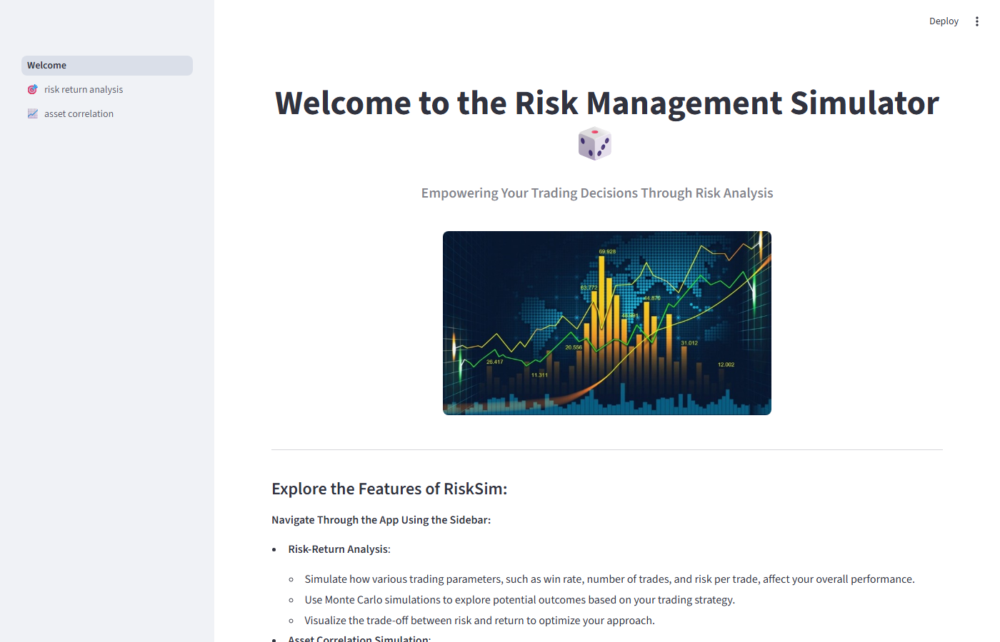</td>
    <td>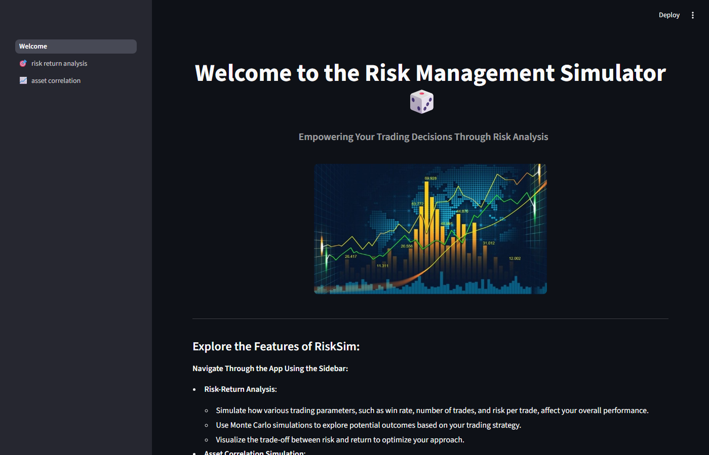</td>
  </tr>
  <tr>
    <td align="center"><em>Light mode</em></td>
    <td align="center"><em>Dark mode</em></td>
  </tr>
</table>

### Risk-Return Analysis

<table>
  <tr>
    <td>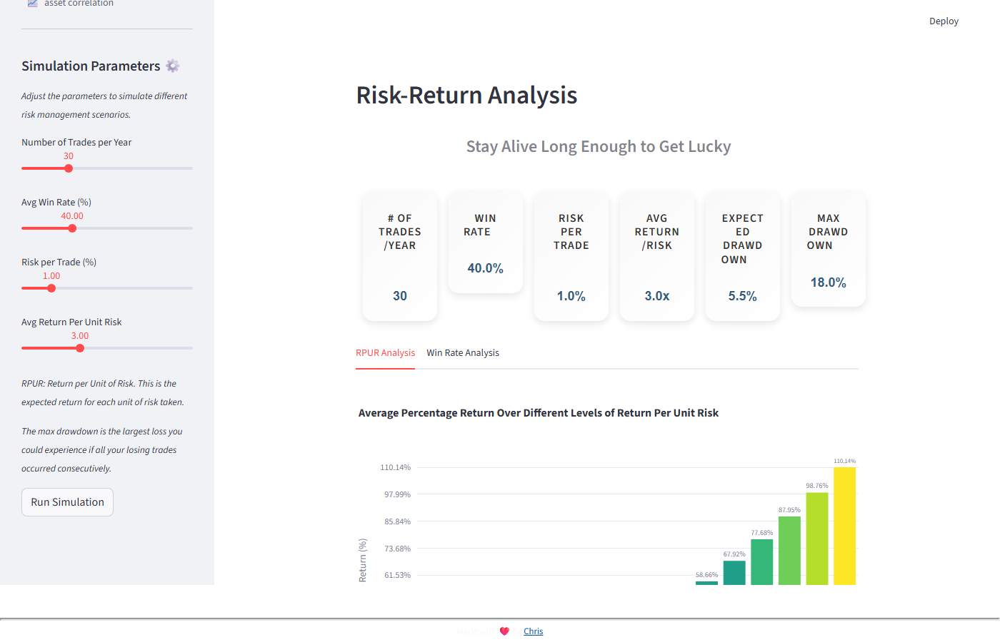</td>
    <td>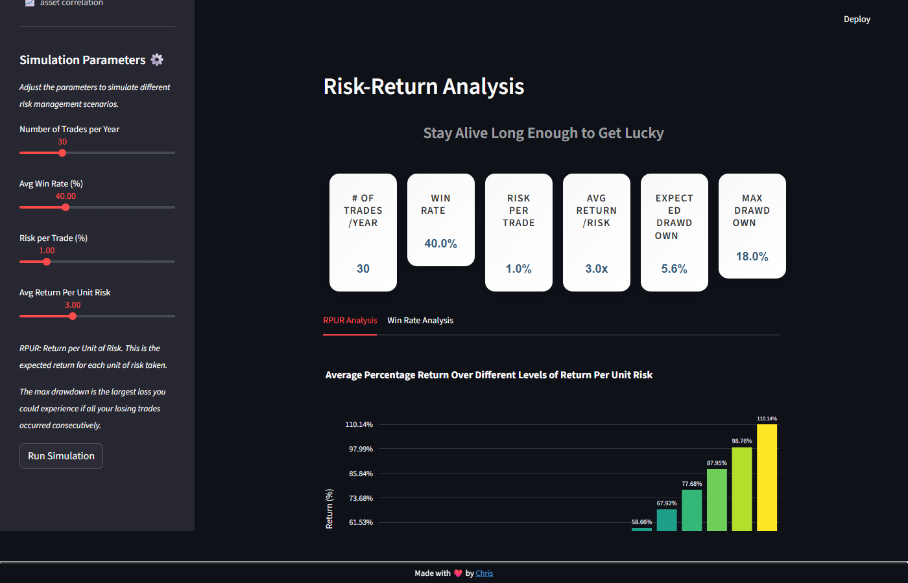</td>
  </tr>
  <tr>
    <td align="center"><em>RPUR sweep &mdash; light mode</em></td>
    <td align="center"><em>RPUR sweep &mdash; dark mode</em></td>
  </tr>
  <tr>
    <td>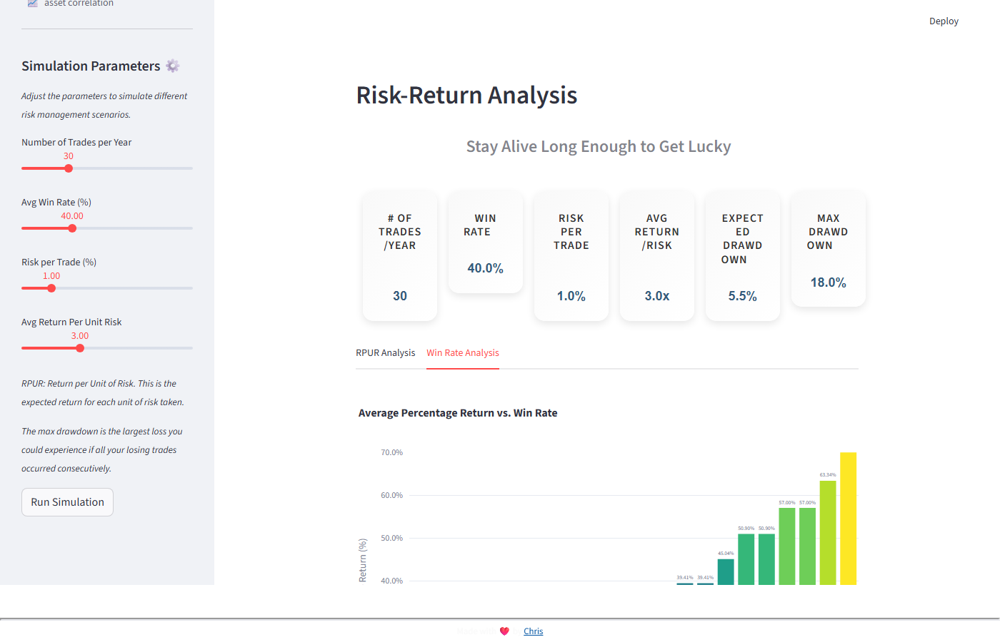</td>
    <td>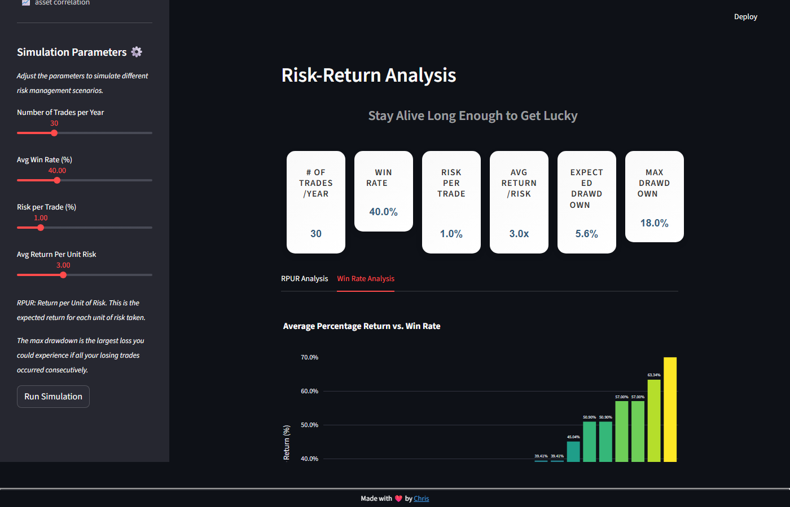</td>
  </tr>
  <tr>
    <td align="center"><em>Win-rate sweep &mdash; light mode</em></td>
    <td align="center"><em>Win-rate sweep &mdash; dark mode</em></td>
  </tr>
</table>

### Asset Correlation Simulator

<table>
  <tr>
    <td></td>
    <td>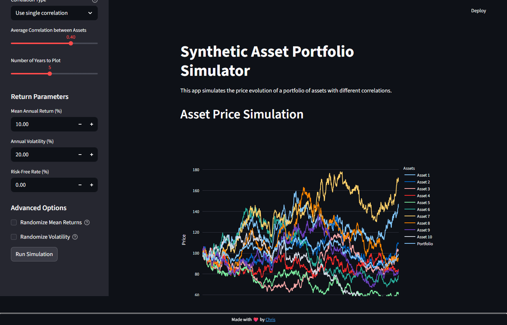</td>
  </tr>
  <tr>
    <td align="center"><em>Synthetic asset price paths &mdash; light mode</em></td>
    <td align="center"><em>Synthetic asset price paths &mdash; dark mode</em></td>
  </tr>
  <tr>
    <td>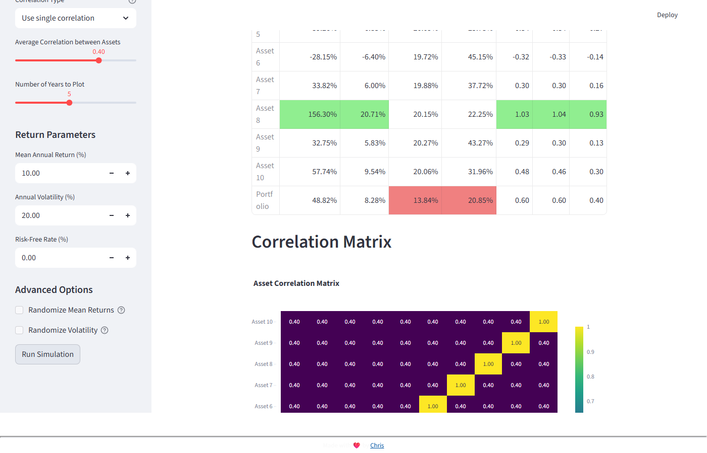</td>
    <td>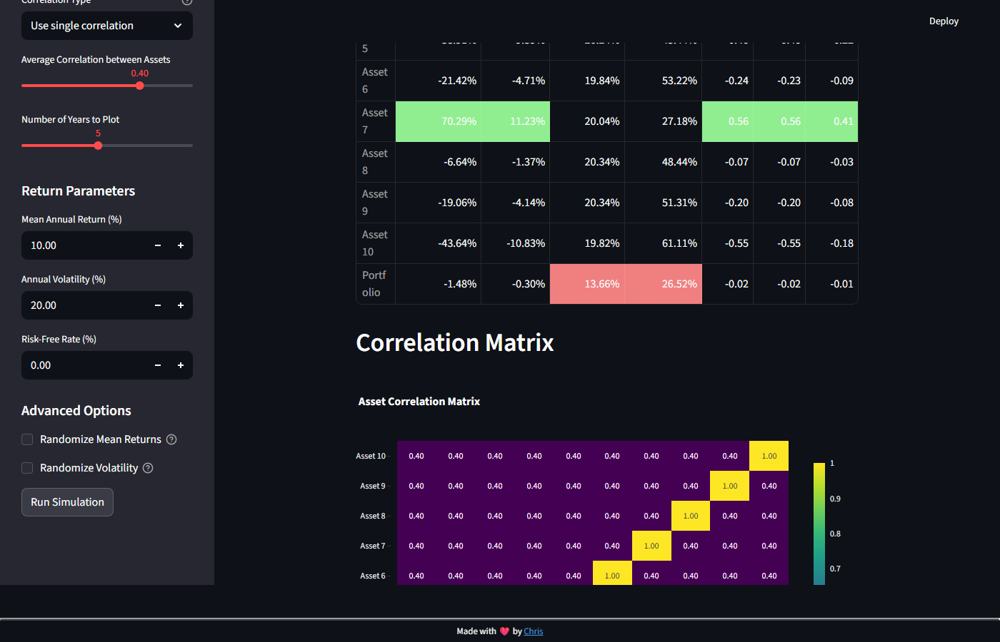</td>
  </tr>
  <tr>
    <td align="center"><em>Correlation matrix heatmap &mdash; light mode</em></td>
    <td align="center"><em>Correlation matrix heatmap &mdash; dark mode</em></td>
  </tr>
  <tr>
    <td>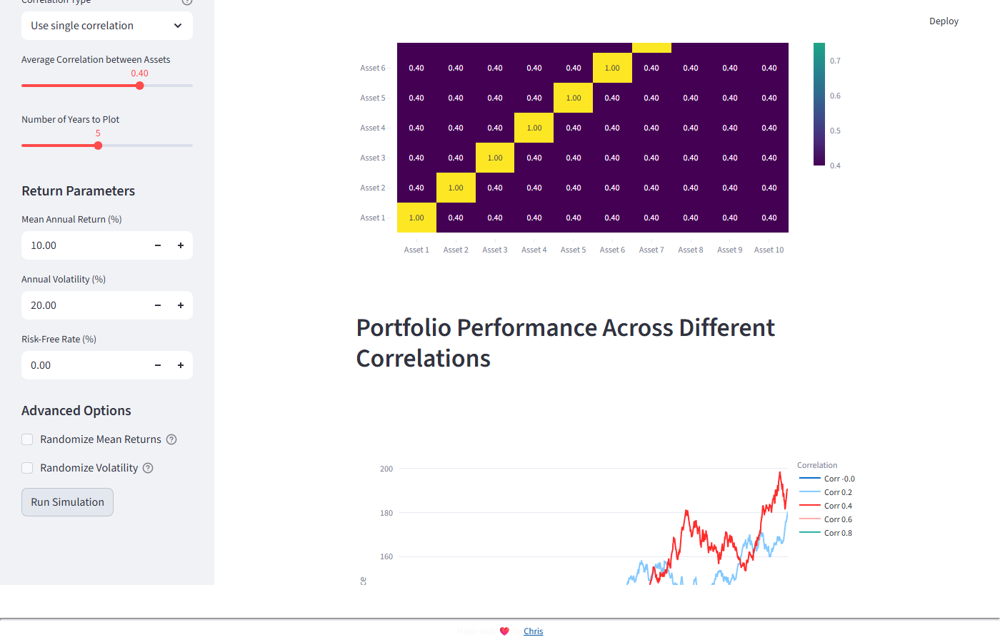</td>
    <td>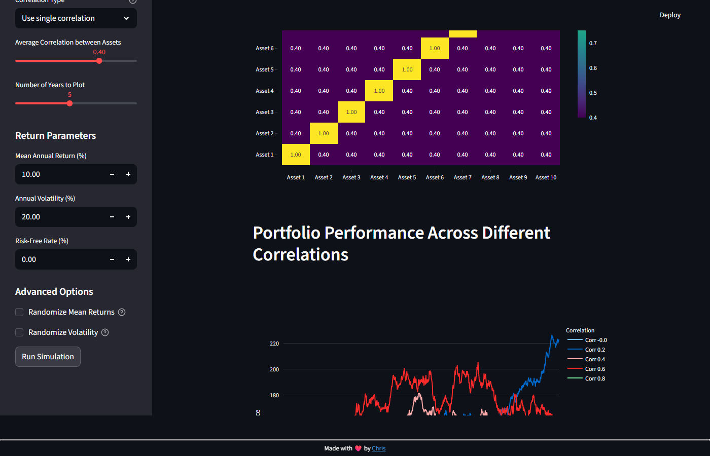</td>
  </tr>
  <tr>
    <td align="center"><em>Correlation sweep &mdash; light mode</em></td>
    <td align="center"><em>Correlation sweep &mdash; dark mode</em></td>
  </tr>
</table>

---

## Getting Started

### Prerequisites

- Python 3.10+

### Install

```bash
git clone https://github.com/chrisduvillard/RiskSim.git
cd RiskSim
python -m venv .venv

# Activate the virtual environment
# Windows:
.venv\Scripts\activate
# macOS / Linux:
source .venv/bin/activate

pip install -r requirements.txt
```

### Run

```bash
streamlit run Welcome.py
```

The app opens in your browser. Use the sidebar to navigate between pages, adjust parameters, and click **Run Simulation**.

---

## Development

### Run tests

```bash
pip install pytest
pytest -v
```

### Lint

```bash
pip install ruff
ruff check .
```

### CI

GitHub Actions runs both `ruff check .` and `pytest` on every push and PR against `main` (Python 3.10 and 3.12).

---

## How It Works

### Risk-Return Analysis &mdash; Monte Carlo Trading Simulation

The simulator models a year of trading as a sequence of independent bets:

1. Each trade risks a fixed percentage of **current** AUM (compounding, not flat sizing).
2. Wins return `risk_amount * RPUR`; losses lose `risk_amount`.
3. Trade outcomes are shuffled randomly each simulation to capture path dependency.
4. The process repeats thousands of times to build a distribution of final portfolio values.
5. Drawdown is estimated by counting the longest streak of consecutive losses across simulations.

This reveals the non-obvious interaction between win rate and reward-to-risk: a 35% win rate with a 4:1 payoff can outperform a 55% win rate with a 1.5:1 payoff.

### Asset Correlation &mdash; Correlated Geometric Brownian Motion

The portfolio simulator generates realistic multi-asset price paths:

1. **Correlation matrix** &mdash; either uniform (all pairs share the same correlation) or random within a user-specified range. Non-positive-definite matrices are projected to the nearest valid matrix.
2. **Covariance matrix** &mdash; constructed from per-asset volatilities and the correlation matrix (`S @ C @ S`).
3. **Log-returns** &mdash; sampled from a multivariate normal distribution with drift adjustment (`mu - 0.5 * sigma^2`) to ensure prices follow geometric Brownian motion.
4. **Metrics** &mdash; computed from the resulting price paths: annualized return, volatility, max drawdown, and risk-adjusted ratios (Sharpe, Sortino, Calmar).
5. **Correlation sweep** &mdash; the entire simulation is repeated across correlation levels from -1.0 to +1.0 to illustrate the diversification benefit.

---

## Project Structure

```
RiskSim/
├── Welcome.py                          # Streamlit entrypoint
├── pages/
│   ├── 1_🎯_risk_return_analysis.py    # Risk-return Monte Carlo page
│   └── 2_📈_asset_correlation.py       # Correlation portfolio page
├── config/
│   └── slider_configs.py               # Centralized slider defaults
├── utils/
│   ├── risk_simulation.py              # TradingSimulator + drawdown estimation
│   └── style.py                        # Footer and metric box helpers
├── tests/
│   ├── test_risk_simulation.py         # Simulation logic tests
│   └── test_style.py                   # Style helper tests
├── .github/workflows/ci.yml            # CI pipeline
├── pyproject.toml                      # Ruff + pytest config
├── requirements.txt                    # Dependencies
├── CHANGELOG.md
├── LICENSE.txt                         # MIT
└── README.md
```

---

## Tech Stack

| Layer | Tool |
|---|---|
| App framework | [Streamlit](https://streamlit.io/) |
| Visualization | [Plotly](https://plotly.com/python/) |
| Numerical engine | [NumPy](https://numpy.org/) + [Pandas](https://pandas.pydata.org/) |
| Styling | [htbuilder](https://github.com/tvst/htbuilder) |
| Linting | [Ruff](https://docs.astral.sh/ruff/) |
| Testing | [pytest](https://docs.pytest.org/) |
| CI | [GitHub Actions](https://github.com/features/actions) |

---

## Contributing

Contributions are welcome. Fork the repo, create a branch, and open a pull request. Please make sure `ruff check .` and `pytest` pass before submitting.

## License

MIT &mdash; see [LICENSE.txt](LICENSE.txt).

## Author

Built by [Christophe Duvillard](https://www.linkedin.com/in/christopheduvillard/)
