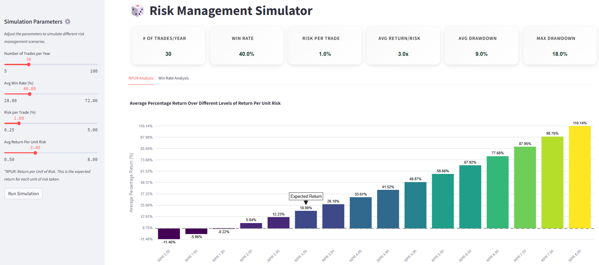
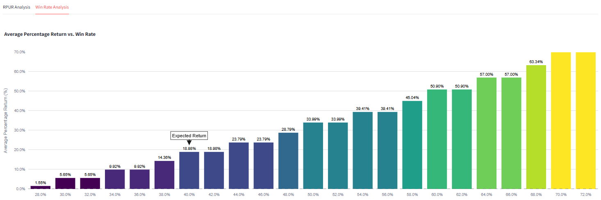
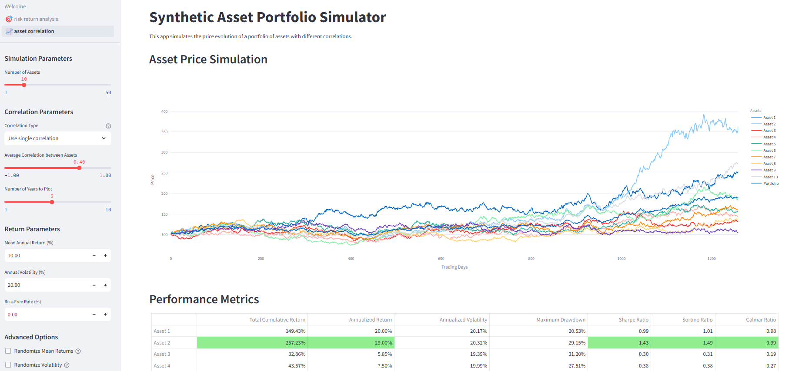
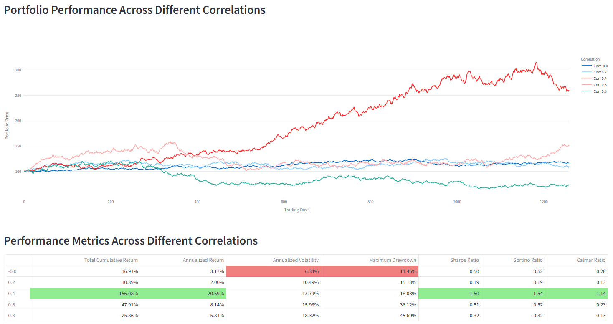

# RiskSim: Risk-Return and Asset Correlation Simulator

**RiskSim** is a Python-based tool designed for portfolio and risk simulation. It offers an intuitive interface to model risk-return dynamics and assess portfolio performance under various asset correlation scenarios, providing deep insights into risk management strategies and investment outcomes.

## Link to the app

[Click here to access the app](https://risk-return-analysis.streamlit.app/)

## Features

- **Risk-Return Analysis**: Simulate various risk-return scenarios using adjustable parameters like win rate, trades per year, risk per trade, and return per unit of risk (RPUR).
- **Asset Correlation Simulator**: Generate and visualize portfolio performance based on customizable asset correlation matrices, with options for single or random correlation ranges.

## Screenshots


*Risk-Return Analysis Page*


*Risk-Return Analysis Page*


*Asset Correlation Simulation Page*


*Asset Correlation Simulation Page*

## Project Structure

```bash
RiskSim/
│
├── pages/
│   ├── 1_🎯_risk_return_analysis.py   # Main page for risk-return simulations
│   └── 2_📈_asset_correlation.py     # Main page for asset correlation simulations
│
├── config/
│   ├── slider_configs.py              # Configuration for slider inputs in the Streamlit UI
│   └── __init__.py                    # Init file for config
│
├── utils/
│   ├── risk_simulation.py             # Core simulation logic for risk management and portfolio performance
│   └── style.py                       # Styling and layout helpers for Streamlit app
│
├── docs/images/                       # Image assets for documentation and app UI
│   ├── header_image.jpg
│   ├── image.png
│   ├── image_1.png
│   ├── image_2.png
│   ├── image_3.png
│   └── image_4.png
│
├── venv/                              # Python virtual environment (optional)
├── Welcome.py                         # Main entry point for the app
├── README.md                          # This file
├── LICENSE.txt                        # License information
├── .gitignore                         # Files and directories to be ignored by git
└── requirements.txt                   # Python dependencies
```

## Installation

To get started with **RiskSim**, follow these steps:

### Prerequisites

Ensure you have Python 3.8+ installed. You'll also need `pip` to install the required dependencies.

### Clone the Repository

```bash
git clone https://github.com/your-username/RiskSim.git
cd RiskSim
```

### Create a Virtual Environment (Optional but Recommended)

```bash
python -m venv venv
source venv/bin/activate  # On Windows use `venv\Scriptsctivate`
```

### Install Dependencies

Install the required Python packages by running:

```bash
pip install -r requirements.txt
```

### Run the Application

Start the application using Streamlit:

```bash
streamlit run Welcome.py
```

This will launch the **RiskSim** app in your browser.

## Usage

### Risk-Return Analysis

- Navigate to the **Risk-Return Analysis** section to simulate various risk-return scenarios.
- You can adjust the number of trades per year, win rate, risk per trade, and RPUR.
- View detailed metrics such as expected drawdown, Sharpe ratio, and more.
  
### Asset Correlation Simulation

- Use the **Asset Correlation** page to simulate portfolios with different asset correlations.
- Choose between fixed or random correlation settings.
- Visualize performance and compute portfolio metrics under various correlation regimes.


## License

This project is licensed under the MIT License. See the [LICENSE.txt](LICENSE.txt) file for details.

## Author

Made with ❤️ by [Chris](https://www.linkedin.com/in/christopheduvillard/)

## Acknowledgments

- Streamlit
- Plotly

## Contributing

Contributions are welcome! Feel free to fork the repository, make improvements, and submit a pull request.
