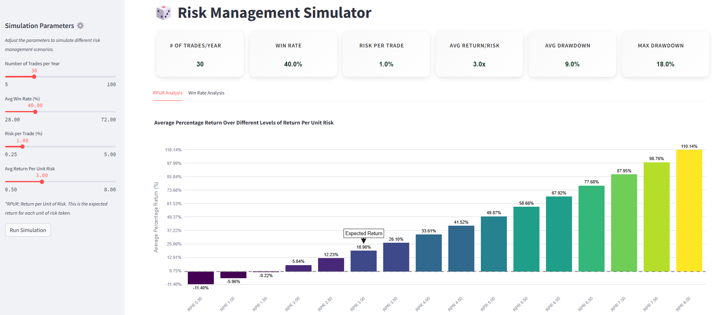

# Risk Management Simulator



## Overview

Risk Management Simulator is a Streamlit-based application designed to simulate trading strategies and their impact on Assets Under Management (AUM). The simulator allows users to adjust various parameters and visualize the potential outcomes of different risk management scenarios.

## Features

- **Trading Simulations**: Simulate trading outcomes over a year with customizable parameters such as win rate, number of trades per year, and risk per trade.
- **Portfolio Risk Analysis**: Assess the risk of a portfolio based on the number of assets and their correlation.
- **Interactive Charts**: Visualize average returns and win rates through interactive Plotly charts.
- **Custom Metrics**: Display key metrics like average drawdown and maximum drawdown.

## Installation

To run the application locally, follow these steps:

1. Clone the repository:
   ```sh
   git clone https://github.com/yourusername/risk-management-simulator.git
   cd risk-management-simulator
   ```

2. Create and activate a virtual environment:
   ```sh
   python -m venv venv
   source venv/bin/activate   # On Windows use `venv\Scripts\activate`
   ```

3. Install the required packages:
   ```sh
   pip install -r requirements.txt
   ```

4. Run the Streamlit app:
   ```sh
   streamlit run src/app.py
   ```

## Project Structure

```
risk-management-simulator/
│
├── src/
│   ├── __pycache__/
│   ├── app.py
│   ├── style.py
│   ├── README.md
│   ├── risk_simulation.py
│
├── config/
│   ├── __pycache__/
│   ├── slider_configs.py
│   ├── __init__.py
│
├── venv/
│
├── requirements.txt
├── .gitignore
└── image.png
```

## Usage

1. Adjust the simulation parameters using the sliders in the sidebar.
2. Click on "Run Simulation" to see the results.
3. Explore the results through the "RPUR Analysis" and "Win Rate Analysis" tabs.

## Example

### Simulation Parameters
- Number of Trades per Year: 100
- Win Rate: 60%
- Risk per Trade: 2%
- Return Per Unit Risk: 1.5

### Visualization

Interactive charts display the average returns and win rates, helping users understand the impact of different trading strategies.

## Contributing

Contributions are welcome! Please fork the repository and submit pull requests for any features, bug fixes, or improvements.

## License

This project is licensed under the MIT License - see the [LICENSE](LICENSE) file for details.

## Author

Made with ❤️ by [Chris](https://github.com/chrisduvillard)

## Acknowledgments

- Streamlit
- Plotly

---

Feel free to reach out if you have any questions or need further assistance.
